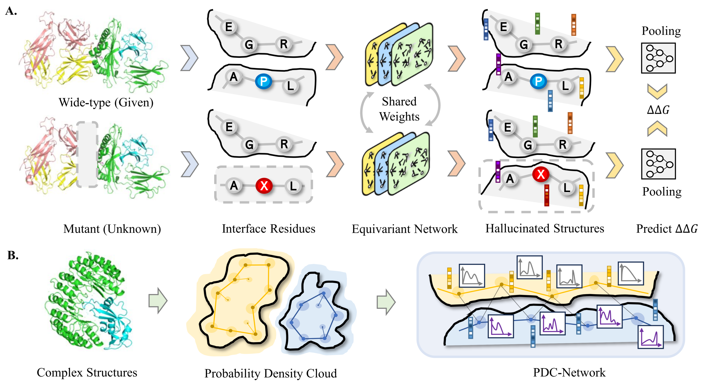

# Refine-PPI
## Overview  
Refine-PPI is a deep learning framework designed for protein-protein interaction modeling. It integrates a structure refinement module trained via Masked Mutation Modeling (MMM) and employs a Probability Density Cloud Network (PDC-Net) to capture 3D dynamic variations and atomic uncertainty.  

For details, refer to:  
📄 **[Dynamics-inspired Structure Hallucination for Protein-Protein Interaction Modeling](https://openreview.net/forum?id=GGHk5ukO6t)**  
✏️ **Authors:** Fang Wu, Stan Z. Li  
📚 **Published in:** Transactions on Machine Learning Research (TMLR)  

---



## Installation  

### Setup Environment  
Create and activate the Conda environment:  
```bash
conda env create -f env.yml -n REFINE
conda activate REFINE
```

Note: The default PyTorch version is 1.12.0. Modify [`env.yml`](./env.yml) if needed.

### Datasets
Download and prepare datasets using the provided scripts:

| Dataset   | Download Script                                    |
| --------- | -------------------------------------------------- |
| [PDB-REDO](https://pdb-redo.eu/)  | [`data/get_pdbredo.sh`](./data/get_pdbredo.sh)     |
| [SKEMPI v2](https://life.bsc.es/pid/skempi2) | [`data/get_skempi_v2.sh`](./data/get_skempi_v2.sh) |

## Usage

### Pretrain 
Train the refinement module using the PDB-REDO dataset:

```bash
python train_rde_network_skempi.py ./configs/pdc_redo_refine.yml
```

### Train Model (DDG Prediction)
Train the model to predict free energy changes upon mutation:
```bash

python train.py ./configs/pdc_ddg_refine.yml

```


### Evaluate Refine-PPI
Evaluate Refine-PPI on SKEMPI v2:
```bash
python test_skempi.py
```

## Citation
If you use Refine-PPI in your research, please cite:
```markdown
@article{wu2025dynamicsinspired,
  title={Dynamics-inspired Structure Hallucination for Protein-Protein Interaction Modeling},
  author={Fang Wu and Stan Z. Li},
  journal={Transactions on Machine Learning Research},
  year={2025},
  url={https://openreview.net/forum?id=GGHk5ukO6t}
}
```